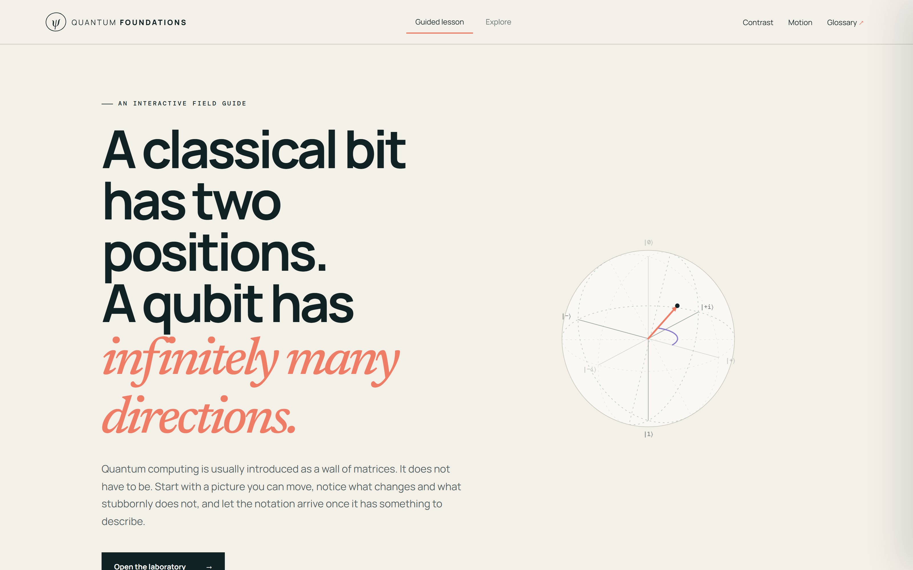
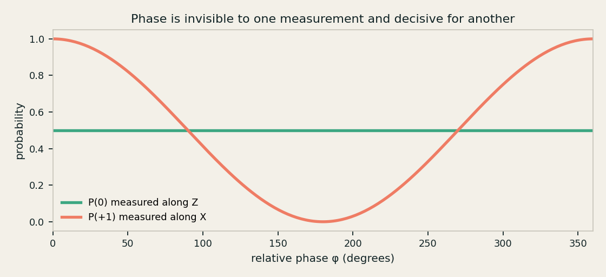
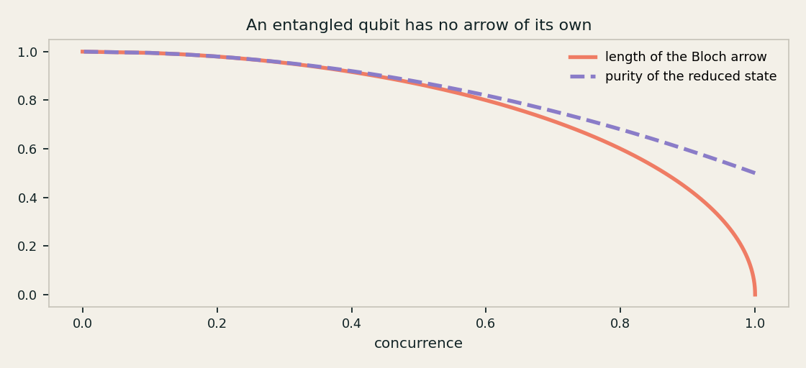
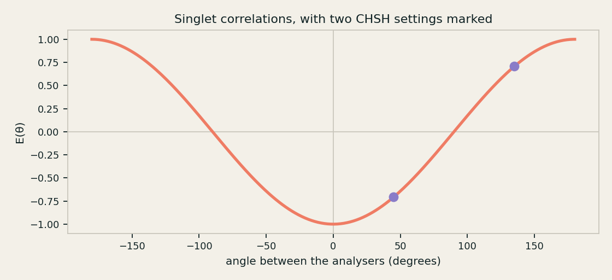
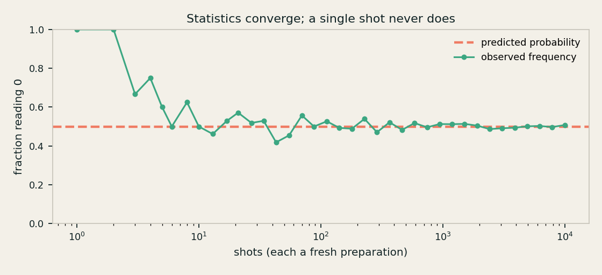

# Quantum Foundations Lab

> A visual path from qubits to entanglement.

An interactive teaching tool for the mathematical language of quantum
computing. Manipulate qubits, rotate states, apply gates, build tensor
products, perform measurements and create Bell pairs — then reveal the formal
mathematics behind each visual.

**This is a mathematical teaching model, not a physical hardware simulator.**
It covers ideal one- and two-qubit systems, deliberately, so that the
underlying ideas stay visible.



---

## Why it is built this way

Quantum computing is usually introduced as a wall of matrices. Every section
here runs the other way round:

> question → picture → experiment → pattern → mathematics → summary → sandbox

The mathematics is always present and always one click away. It is never the
first thing you meet.

The app also takes seriously the things it must *not* imply. It never says a
qubit is "both 0 and 1", never draws spin as a spinning ball, never presents an
entangled qubit as an independent pure state, and never suggests entanglement
carries information. These are enforced by tests, not by good intentions — see
[Guarded claims](#guarded-claims).

---

## Quick start

Requires **Node 20+** and **Python 3.11+**.

```bash
# The mathematical core and its tests
python -m pip install -e ".[dev]"
python -m pytest

# The web app
cd apps/web/frontend
npm install
npm run dev          # http://localhost:5173
```

Optionally, the API and the Streamlit front end:

```bash
python -m pip install -e ".[web,streamlit]"

uvicorn apps.web.backend.main:app --reload        # http://127.0.0.1:8000/docs
streamlit run apps/streamlit/foundations_lab.py
```

The web app runs entirely in the browser. The backend exists for
reproducibility, validation and export, not because the app needs it.

---

## What is inside

### The guided lesson

Eleven sections, each with one question, one interactive visual, an experiment,
revealable mathematics, a misconception guard and a checkpoint.

| # | Section | Specification |
| --- | --- | --- |
| 1 | Two positions, or every direction | §8.1 |
| 2 | You already own a measuring device | §8.2 |
| 3 | The number that hides, then decides | §8.3 |
| 4 | Three turns, and the matrices that name them | §8.4 |
| 5 | Every move can be unmade | §8.5 |
| 6 | Asking a question changes the answer | §8.7 |
| 7 | A matrix that is a question, not a move | §8.8 |
| 8 | Four numbers where there were two | §8.6 |
| 9 | A pair with no parts | §8.9 |
| 10 | Two gates, and the pair exists | §8.10 |
| 11 | Correlations no list of instructions can fake | §8.11 |

### The Explore laboratory

Every control from the lesson in one place, in one- and two-qubit modes.


One qubit: Bloch sphere, amplitudes, phasors, circuit builder, cumulative
matrix, arbitrary measurement axes and shot statistics.

Two qubits: joint amplitudes, reduced states, correlation table, entanglement
indicator, density-matrix heatmaps and joint measurement statistics.

---

## Four pictures worth the whole README

**Phase is invisible to one measurement and decisive for another.** Turning the
relative phase leaves the Z-basis odds flat and swings the X-basis odds from
certain to impossible.



**An entangled qubit has no arrow of its own.** As concurrence rises, each
subsystem's Bloch arrow shrinks; at a Bell pair it reaches zero.



**Correlations no local model can produce.** E(θ) = −cos θ for the singlet.



**Statistics converge; a single shot never does.**



Regenerate all four with `python scripts/make_readme_figures.py`. They are
computed from the core, so a change to the mathematics cannot leave a stale
picture behind.

---

## Repository layout

```text
quantum_foundations/     The mathematical core — the reference implementation
  core/                  states, gates, tensor, measurement, observables, entanglement
  lessons/               the canonical lesson spine and worked examples
apps/
  web/frontend/          React + TypeScript app (the primary experience)
  web/backend/           FastAPI service over the same core
  streamlit/             a second front end for Python-only classrooms
tests/                   core, api, integration
scripts/                 figure generation and the cross-implementation probe
docs/                    architecture, conventions, classroom notes
```

The core depends only on NumPy and knows nothing about React, FastAPI, lesson
copy or animation timing. The frontend reproduces the same mathematics in
TypeScript so interaction is instant; the two are checked against each other
automatically.

Further reading: [architecture](docs/architecture.md) ·
[mathematical conventions](docs/conventions.md) ·
[classroom notes](docs/classroom.md).

---

## Testing

```bash
python -m pytest                       # core, API, integration
cd apps/web/frontend
npm test                               # component and mathematics tests
npx playwright test                    # end-to-end, in a real browser
```

Three checks are worth calling out.

**The two implementations are compared, not assumed to match.** The frontend's
TypeScript mathematics is bundled and run under Node, and every number is
checked against the Python core to 1e-11 or better.

**Lesson structure is a test.** Every section must supply a visual, an
experiment, revealable mathematics and a checkpoint; adding one without any of
those fails the build.

<a id="guarded-claims"></a>
**The claims the app must not make are guarded.** The suite fails if the
interface ever says a qubit is "both 0 and 1" outside a misconception guard, or
claims entanglement transmits information, or describes the Bloch sphere as a
physical object, or draws spin as a spinning ball.

---

## Scope and limits

* One and two qubits only. Beyond that the educational value falls while the
  interface cost rises sharply.
* Circuits up to 24 operations; up to 100,000 simulated shots per request.
* Sampling is ideal: no decoherence, no gate error, no readout noise.
* The CHSH panel is an ideal theoretical model. It assumes perfect detectors
  and freely chosen settings, and simulates no detection or locality loophole.

---

## Contributing

See [CONTRIBUTING.md](CONTRIBUTING.md) and the
[Code of Conduct](CODE_OF_CONDUCT.md). The most useful thing you can bring is a
place where the explanation is *wrong* or misleading — those are the bugs that
matter most here.

## Licence

MIT. See [LICENSE](LICENSE).
